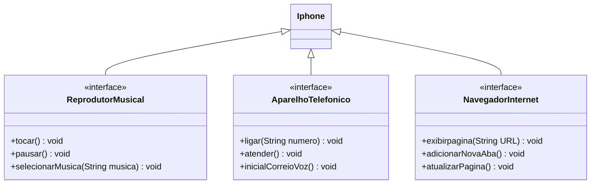

```mermaid
    classDiagram
    Iphone <|-- ReprodutorMusical
    Iphone <|-- AparelhoTelefonico
    Iphone <|-- NavegadorInternet

    class ReprodutorMusical{
    <<interface>>
    +tocar() void
    +pausar() void
    +selecionarMusica(String musica)void
    }

    class AparelhoTelefonico{
    <<interface>>
    +ligar(String numero) void
    +atender() void
    +inicialCorreioVoz()void
    }

    class NavegadorInternet{
    <<interface>>
    +exibirpagina(String URL) void
    +adicionarNovaAba() void
    +atualizarPagina()void
    }
```
